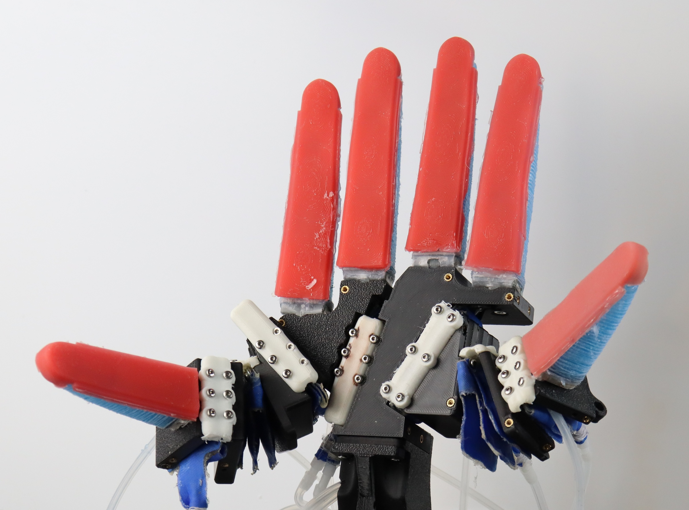

Robotics is a co-design problem: behavior emerges from the interaction of body, sensing, and control. In this work, we distill 15 years of applied co-design in the RBO Lab across three generations of soft, pneumatically actuated hands, and extract lessons from contact-rich grasping and in-hand manipulation. The central message is to trust the hand: exploit compliance instead of “controlling it away,” and use environmental constraints to achieve simple, robust behavior. 

This book chapter appears in the open-access Springer book Soft Material Robotics. It's is also the first work that features our new hand design with two thumbs.

