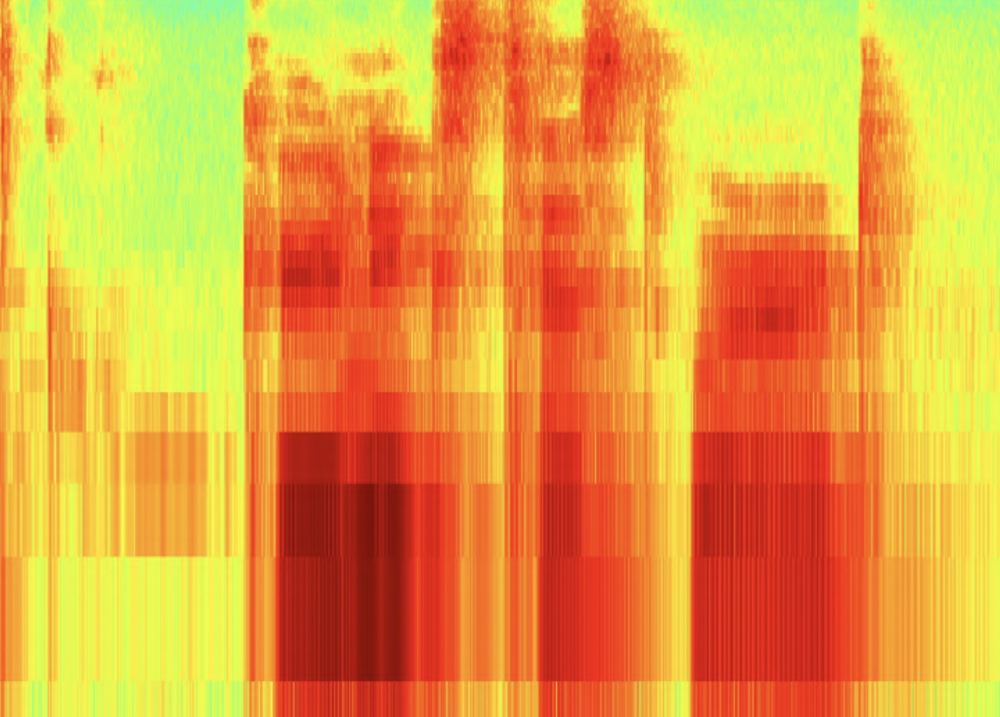

I participated in a course on neuroprosthetics at the [TUM Chair for Bio-inspired Information Processing](https://www.ce.cit.tum.de/en/bai/home/). In the practical part, I coded up the infamous Hodgkin-Huxley model and simulated neuronal behavior with different electrical stimuli. Further, I implemented basic encoding strategies for cochlear implants and a noise vocoder to study the signals as perceived by the patient.