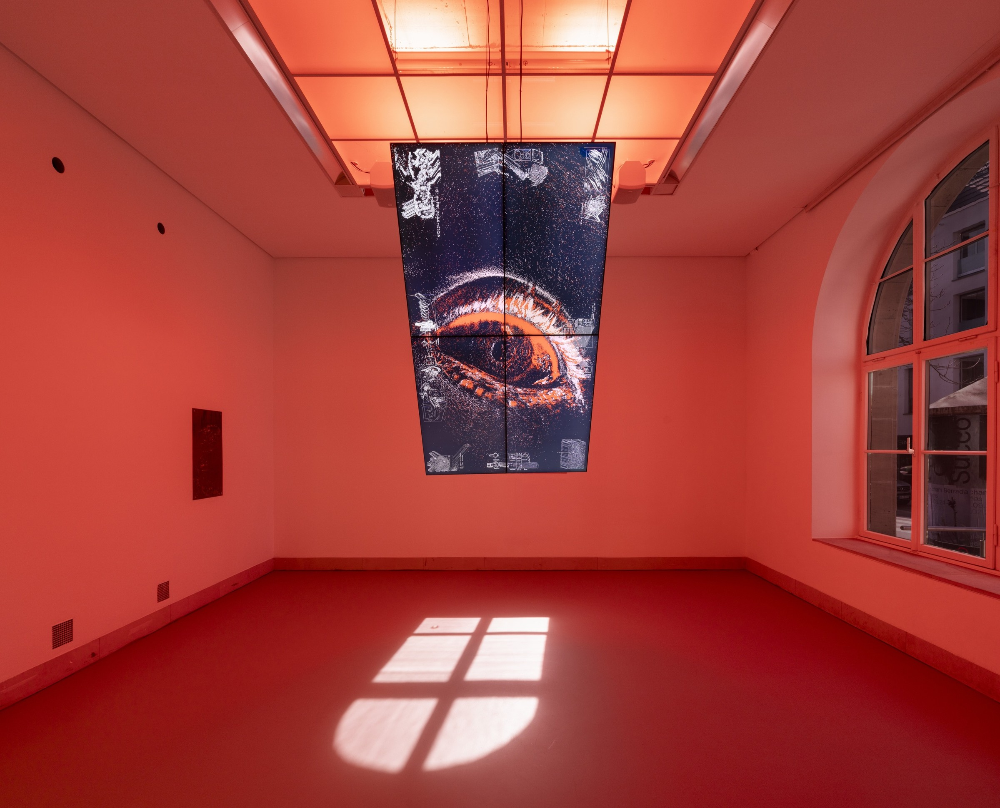
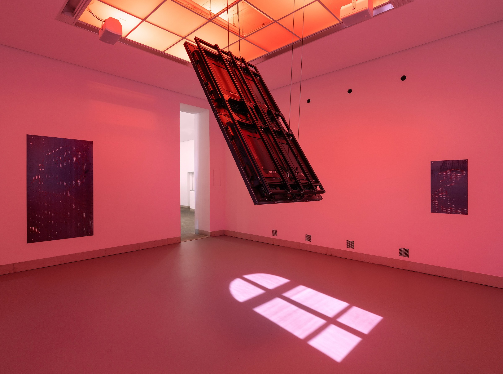
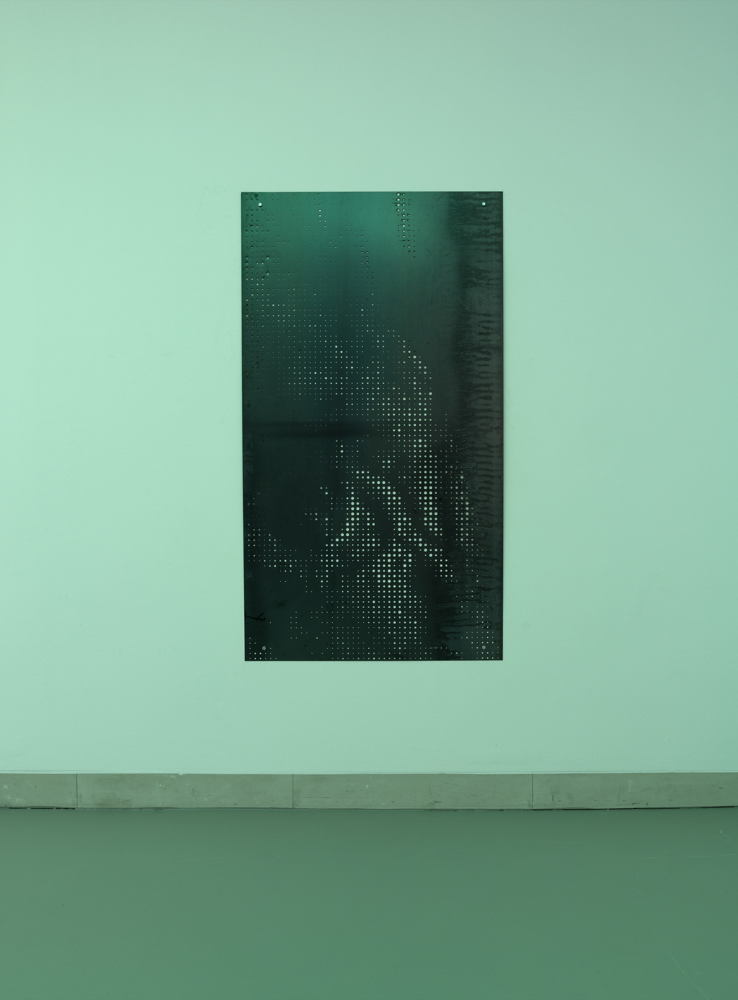

BLINDHÆD is the first multi-media installation featuring event cameras. Event-based vision is a novel computer vision technique in which the imaging sensor only responds to local changes in brightness. Event cameras only react to movement in their visual field. Thereby, they produce radically different, otherworldly imagery that offers a novel artistic interpretation of vision itself.

Historically, human sight has been subject to optimization - from glasses to microscopes and telescopes. BLINDHÆD explores this ongoing transformation of seeing in a world increasingly shaped by technology and body enhancement.

BLINDHÆD is the first institutional solo exhibition of Justin Urbach, on display at the [Galerie Stadt Sindelfingen](https://galerie-sindelfingen.de/?lang=en) from March 8 through May 25, 2025. The piece has since been shown in Nashville (USA) at the [AI Art Exhibition of the Conference on Computer Vision and Pattern Recognition (CVPR)](https://thecvf-art.com/project/blindhaed/), the leading research conference on machine vision, where we continued the piece's dialogue in the scientific community. BLINDHÆD was then shown at the DOK Leipzig film festival in October 2025, as part of the exhibition [DOK Neuland](https://www.dok-leipzig.de/dok-neuland) on Extended Reality.

The first exhibition room presents an artistic rendering of laser eye surgery, while the second room symbolizes the post-enhancement sense of seeing. In room two, event-based vision serves as a metaphor for this transformation: abstract forms emerge from a sea of pixels on a large 2 × 1.2-meter monitor wall, representing a human navigating a new perceptual reality. The human interplay with a robotic arm further illustrates the merging of human and machine, depicting a haunting yet emotional symbiosis. The artwork paints an outlook into the continuation of the constant trend of technological enhancement of our senses. Elements in the exhibition, such as the engraved laser etchings on the surface of the monitors, allude to the irreversibility of such enhancements, further reinforcing our technological dependency.

BLINDHÆD is an interdisciplinary collaboration between artists and researchers. The media artist [Justin Urbach](https://www.justinurbach.com/about) (*1995, Academy of Fine Arts Munich) teams up with scientists from TU Berlin's Robotic Interactive Perception group (PhD Student [Friedhelm Hamann](https://friedhelmhamann.github.io/) and [Prof. Guillermo Gallego](https://sites.google.com/view/guillermogallego)) and the Robotics and Biology Lab (PhD Student [Alexander Koenig](https://axkoenig.github.io/html/about.html) and [Prof. Oliver Brock](https://www.tu.berlin/robotics/ueber-rbo/prof-dr-oliver-brock)). The Berlin-based duo Aqua Veen ([William East](https://soundcloud.com/aquaveen) and [Alexander Koenig](https://axkoenig.github.io/html/about.html)) creates an immersive soundscape for the event-based video installation: computer vision algorithms extract shapes from the event video stream and control synthesizers to create an immersive and reactive sonic dimension of the futuristic visual signals.

In BLINDHÆD, vision is no longer static or purely human. It is optimized, expanded, and intertwined with technology. The exhibition invites reflection on the limits of perception and the speculative future of seeing.

### Curatorial Text by Marisa Zeising

> BLINDHÆD lässt uns weiter blicken, als unsere Augen es vermögen. Sehen ist eine Sinnespraxis, die uns durch die Welt führt, sie für uns erschließt und erfahrbar macht. Sie ist Mittel der Wissenskonstruktion und beeinflusst unser Verständnis der Realität grundlegend. Doch wie sehen wir, wie treten Bilder in unser Bewusstsein ein und wie werden sie verändert? Und was bedeutet es, wenn Sehen kein natürlicher Prozess mehr ist?
>
> In zwei sich kontrastierenden Räumen spürt Justin Urbach diesen Fragen nach. Während er im ersten Ausstellungsraum das visuelle Wahrnehmen als körperliche Erfahrung und dessen technologische Optimierung in den Blick nimmt, steht im zweiten Raum das maschinelle Sehen im Fokus – ein datenbasierter Prozess, der sich von der menschlichen Wahrnehmung entkoppelt und eine neue Form der Bildproduktion etabliert.
>
> Angelockt durch ein waberndes Licht und eine Soundkulisse aus algorithmischen Klängen, die aus den technischen Parametern der Videoarbeiten ausgelesen und in synthetische Töne verwandelt werden, zieht es uns Betrachtende in den ersten Ausstellungsraum. Wir treffen auf eine anfänglich unscharfe Videoprojektion, die nach einiger Zeit ein rotierendes Auge sichtbar werden lässt, das einer Laseroperation unterzogen wird. Seit Jahrhunderten werden Hilfsmittel entwickelt, um das Sehen zu verbessern. Fernrohre, Brillen und Mikroskope erweitern den menschlichen Blick.
>
> Gegenwärtig wird jedoch mit Hilfe moderner Technologien, wie eben mit einer Laseroperation, direkt in das Auge eingegriffen, um dessen Sehkraft zu optimieren oder wiederherzustellen. Einen spekulativen Ausblick in die Zukunft gewährt währenddessen ein weiteres Video im Kabinett. Die Arbeit beschäftigt sich mit der Möglichkeit, dass ins Auge implantierte Mikrochips, die mit dem Gehirn und einer speziellen Kamerabrille verbunden sind, blinden Menschen das Sehen wieder ermöglichen könnten. Urbach verweist mit dieser Arbeit auf Verfahren der Augenchirurgie, die nicht mehr nur medizinische Korrekturen am Körper vornehmen, sondern die Wahrnehmung mit Hilfe digitaler Technologien gezielt erweitern.
>
> Auf den Bildschirmen wurde der Vorgang des Augenlaserns nachempfunden, indem ihre Oberflächen durch filigrane Lasergravuren bearbeitet wurden. Die Screens sind nicht mehr nur Wiedergabegeräte, sondern auch eigenständige Informationsträger, die technische Zeichnungen und Datensätze abbilden, welche die wissenschaftlichen Grundlagen der verschiedenen Sehweisen sichtbar machen. Sie fungieren als visuelle Filter, die die strukturellen Bedingungen des Sehens offenlegen und den maschinellen Prozess entschlüsseln.
>
> Ein Verweis auf wissenschaftliche Forschungen, die stets in Justin Urbachs Werke einfließen und sie überhaupt erst ermöglichen.
> Zudem begegnen wir einer von der Decke hängenden Plastik, die den Akt des Sehens in eine skulpturale Formensprache überführt. Ein blauer Laserstrahl wird durch eine Kathodenstrahlröhre gelenkt und trifft auf eine Membran aus mehreren übereinander gelagerten transparenten Acrylschichten, die die Netzhaut des menschlichen Auges nachbildet. Während unser Auge kontinuierlich Licht aus der Umgebung aufnimmt und das Gehirn daraus ein Bild konstruiert, veranschaulicht die Kathodenstrahlröhre, wie gezielte Lichtemissionen und Strahlensteuerung zur Erzeugung der ersten bewegten Bilder führten, ein Prinzip moderner Bildgebungsverfahren.
>
> Feine Gravuren auf der Membran offenbaren Forschungsergebnisse zum Infrarotsehen, bei dem Nanopartikel im Auge das sichtbare Farbspektrum erweitern, was bislang jedoch nur an Tierversuchen mit Mäusen erprobt wurde. Wandreliefs aus gestanztem Stahl sind hingegen Vorgriffe auf die pixelhaften Silhouetten des maschinellen Sehens, die uns in einer weiteren Videoinstallation im zweiten Ausstellungsraum erwarten.
>
> Durch die Lichtdecke hängt dort eine Videowand, auf deren Bildschirmen abstrakte, technoid verzerrte Konturen flackern. Aus einem Meer einzelner Pixel tauchen flüchtige Körper auf. Mal deutet sich ein Auge an, mal ein Maschinenteil. Justin Urbach greift für diese Arbeit auf sogenannte neuromorphe eventbasierte Kamerasysteme zurück. Licht und Bewegung werden nicht mehr in Einzelbildern erfasst, sondern als kontinuierlichen Datenstrom verarbeitet. Das maschinelle Sehen operiert auf einer mikrotemporalen Skala, die eine neue Wahrnehmung von Raum und Zeit ermöglicht, und sich der unmittelbaren menschlichen Erfahrung entzieht. Derartige Technologien imitieren nicht nur die Physiologie des Auges, sondern erweitern sie auch, sodass die Ontologie des Bildes aus dem Feld der rein menschlichen Wahrnehmung heraustritt.
>
> Die Bilder übernehmen eine operative Funktion, indem sie innerhalb automatisierter und technischer Prozesse agieren. Sie sind nicht mehr für den Menschen geschaffen, sondern ausschließlich für andere Maschinen.
>
> Das titelgebende BLINDHÆD, ein isländisches Straßenschild, das vor eingeschränter Sicht warnt, ist für die gesamte Ausstellung eine Metapher für die Grenzen menschlicher Wahrnehmung. Die Werke der Ausstellung bewegen sich zwischen gegenwärtiger Realität und spekulativer Zukunft. Sie zeigen, dass der menschliche Blick längst nicht mehr unveränderlich ist. Vielmehr ist er optimiert, korrigiert oder gar erweitert. Dabei stellt Justin Urbach zur Diskussion, inwieweit diese Optimierungen und Erweiterungen unsere Wahrnehmung und unser Verständnis vom Sehen transformieren und fordert uns auf, unsere eigenen Wahrnehmungsmuster zu hinterfragen, um über die Welt nachzudenken, die wir sehen, und jene, die uns verborgen bleibt.