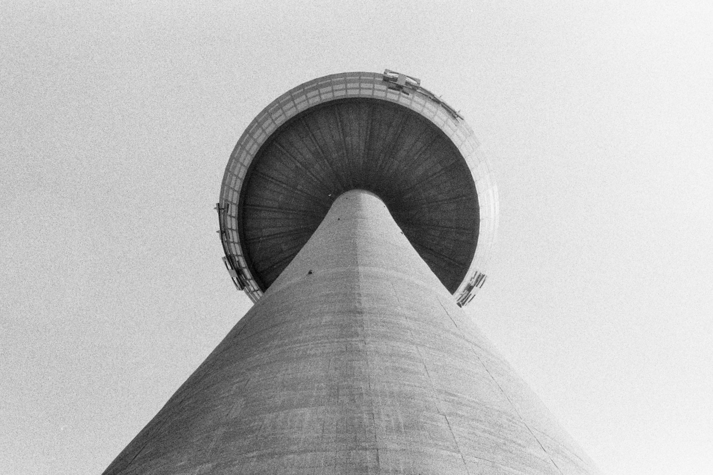

This series examines monumental architectural structures and their imposing presence in urban landscapes. The photographs capture the essence of these concrete and steel giants, revealing their geometric forms and the interplay between light and shadow.

Street Lamp Finsbury Health Centre, London

Hellisheiði Power Station, Selfoss  
Tark and Landslag Architects, 2011

Augsburger Hotelturm, Augsburg  
Reinhard Brockel and Erich Müller, 1972

Colonius Telecommunications Tower, Cologne  
Fritz Leonhardt and Erwin Heinle, 1981

The work captures the essence of urban architecture through careful composition and attention to detail, revealing the beauty in everyday built environments. These structures stand as testaments to human ambition and engineering prowess, while simultaneously questioning their relationship with the spaces they inhabit.
