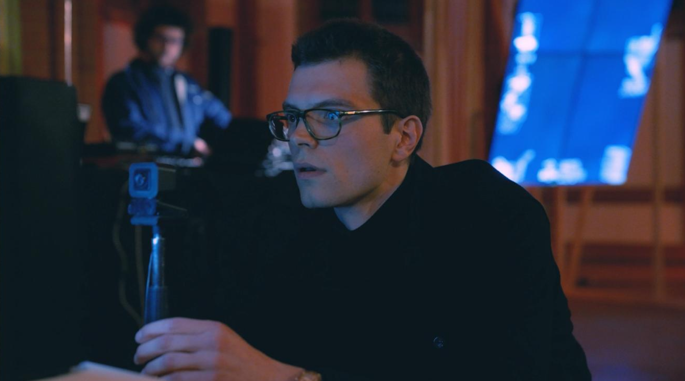

Part one is the procedure. Aqua Veen will perform an example of the procedure to the audience, in which audio synthesis is used to probe a self-referential embodiment of the human visual system. In this system, a Projector and a Beholder create a transient and ephemeral audio-visual connection. The performance is an attempt to calibrate this relationship amidst the landscape of radio frequency interferences present in this space.

In the second part of the performance, we see the consequences of the procedure: the human emerges from it with an altered perception. The attention is drawn to the video wall in which the human perception shifts towards a neuromorphic reality. Event-based camera systems generate a continuum of data in microtemporal timeframes. This data is intercepted by computer vision algorithms that directly control the duo’s musical instruments. Whereas in the first part, human-controlled instruments are only modulated by the probing process, in the second part, the system is given autonomy to generate audio signals, placing the human performers in a supervisory role. 
