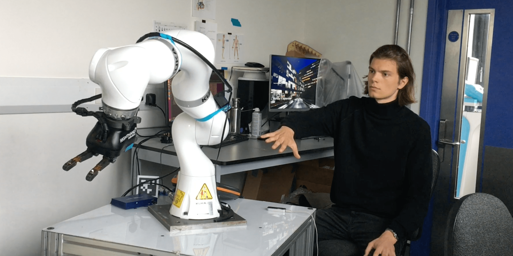

During my research internship at the [Mechatronics in Medicine Lab](http://www.imperial.ac.uk/mechatronics-in-medicine) at Imperial College London, I built a modular ROS platform to intuitively control a robotic rig with a gesture tracker. Visual feedback via a virtual reality headset allows for remote teleoperation of the robot. I also used data from an RGB-D camera to play with ideas regarding autonomous robotic grasping.

The [IEEE RO-MAN](https://ro-man2021.org) conference 2021 accepted our paper on the educational use of this platform. The system demonstrates how gesture-based control can provide an intuitive interface for robotic manipulation tasks, making robotics more accessible for educational purposes.

The platform combines Leap Motion gesture tracking with ROS-based robot control, creating a seamless interface between human intention and robotic action. The virtual reality feedback provides operators with an immersive view of the robot's workspace, enabling precise manipulation even from remote locations.

This work was conducted in collaboration with [Dr. Secoli](https://www.imperial.ac.uk/people/r.secoli) and [Prof. Rodriguez y Baena](https://www.imperial.ac.uk/people/f.rodriguez).

## Resources
- [Paper](../../downloads/research/roman_paper.pdf)
- [IEEE Xplore](https://ieeexplore.ieee.org/document/9515390)
- [Talk](https://www.youtube.com/watch?v=fNvErR5eUpc)
- [Code Repository](https://github.com/axkoenig/leap_teleop)
- [Handbook](../../downloads/research/handbook_compressed.pdf)
- [Demo Video](https://www.youtube.com/watch?v=RDbpd9d7U2k)
- [Lab Blog](https://www.imperial.ac.uk/mechatronics-in-medicine/research/human-robot-interaction-for-object-manipulation/)

